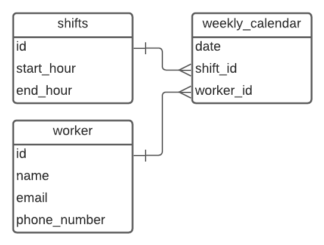

# REST App for Work Planning Service

### **Basic Business Requirements**
* A worker has shifts
* A shift is 8 hours long
* A worker never has two shifts on the same day
* It is a 24 hour timetable 0-8, 8-16, 16-24

----
### **Assumptions**

For the sake of this exercise the following assumptions have been made
* The test is limited to develop the REST service for a detached App.
* No security checks are performed on API calls.
* No validation is being made on the length of the shift.
* Worker Model and its attributes are simplied for test purposes.
* The Data model is abstracted for just one company and locality.
* Django and DRF Framework have been picked for the development of the task.
* No Paginitation has been implemented

----
### **Data Model**

_____
### Environment
* python 3.8.12
* django==3.2.9
* django-rest-framework==3.12.4
* List of complete packages used on **requirements.txt**

_____
### **API Endpoint Reference**

* Worker Model

|Method    |Endpoint    |Usage    |
|----------|------------|---------|
|GET       |/api/v1/worker| Get the list of Workers|
|GET       |/api/v1/worker/{personal_id}/| Get a Worker|
|POST      |/api/v1/worker/create| Create a new Worker|
|PATCH      |/api/v1/worker/update/{personal_id}/| Update a Worker|
|DESTROY      |/api/v1/worker/delete/{personal_id}/| Delete a Worker|

* Shift Model

|Method    |Endpoint    |Usage    |
|----------|------------|---------|
|GET       |/api/v1/shift| Get the list of Shifts|
|GET       |/api/v1/shift/{id}/| Get a Shift|
|POST      |/api/v1/shift/create| Create a new Shift|
|PATCH      |/api/v1/shift/update/{id}/| Update a Shift|
|DESTROY      |/api/v1/shift/delete/{id}/| Delete a Shift|

* Workplan Model

|Method    |Endpoint    |Usage    |
|----------|------------|---------|
|GET       |/api/v1/workplan| Get the list of Workplans|
|GET       |/api/v1/workplan/{id}/| Get a Workplan|
|POST      |/api/v1/workplan/create| Create a new Workplan|
|PATCH      |/api/v1/workplan/update/{id}/| Update a Workplan|
|DESTROY      |/api/v1/workplan/delete/{id}/| Delete a Workplan|

_____
### **Tests**

The following test scenarios have been created as a demonstration:
* API Worker List View
* API Worker Detail View
* API Worker Create View
* API Validation of a worker working just one shift per day when creating a new Workplan
